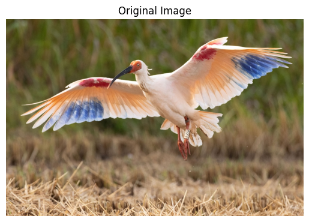
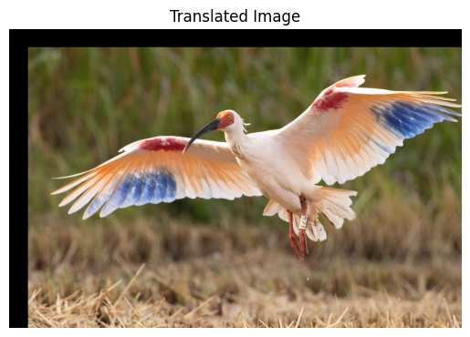
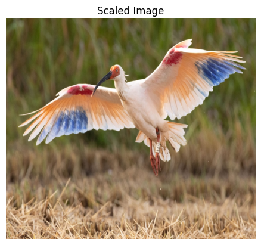
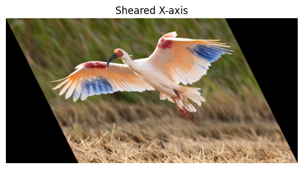
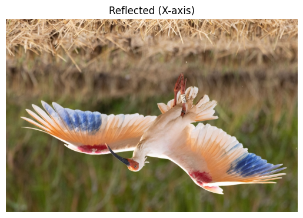
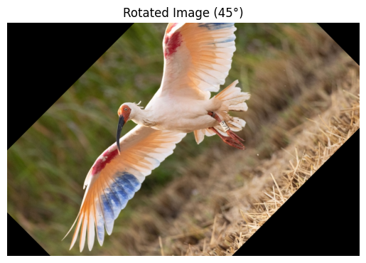
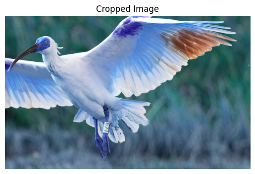

# IMAGE-TRANSFORMATIONS


## Aim
To perform image transformation such as Translation, Scaling, Shearing, Reflection, Rotation and Cropping using OpenCV and Python.

## Software Required:
Anaconda - Python 3.7

## Algorithm:
### Step1:
Import necessary libraries such as OpenCV, NumPy, and Matplotlib for image processing and visualization.

### Step2:
Read the input image using cv2.imread() and store it in a variable for further processing.

### Step3:
Apply various transformations like translation, scaling, shearing, reflection, rotation, and cropping by defining corresponding functions:
```
1.Translation moves the image along the x or y-axis.
2.Scaling resizes the image by scaling factors.
3.Shearing distorts the image along one axis.
4.Reflection flips the image horizontally or vertically.
5.Rotation rotates the image by a given angle.
```
### Step4:
Display the transformed images using Matplotlib for visualization. Convert the BGR image to RGB format to ensure proper color representation.


### Step5:
Save or display the final transformed images for analysis and use plt.show() to display them inline in Jupyter or compatible environments.

## Program:

Developed By:GURUMURTHY S
Register Number:212223230066

original image
```python
import cv2
import numpy as np
import matplotlib.pyplot as plt
input_img = cv2.cvtColor(cv2.imread("image_1.jpg"), cv2.COLOR_BGR2RGB)
plt.axis('off')
plt.imshow(input_img)
plt.title("Original Image")
plt.show()
```


i)Image Translation
```python
rows, cols, dim = input_img.shape
M = np.float32([[1, 0, 50],   # Move 20 pixels right
                [0, 1, 50]])  # Move 50 pixels down
translated_img = cv2.warpAffine(input_img, M, (cols, rows))
plt.axis('off')
plt.imshow(translated_img)
plt.title("Translated Image")
plt.show()
```


ii) Image Scaling
```python
# Perform scaling
scaled_img = cv2.resize(input_img, None, fx=1.5, fy=2.0, interpolation=cv2.INTER_LINEAR)
# Show the scaled image
plt.axis('off')
plt.imshow(scaled_img)
plt.title("Scaled Image")
plt.show()
```


iii)Image shearing

```python
# Shearing in X-axis
M_x = np.float32([[1, 0.5, 0],[0, 1,   0]])
# Apply shearing
sheared_img_xaxis = cv2.warpAffine(input_img, M_x, (int(cols + 0.5 * rows), rows))
plt.axis('off')
plt.title("Sheared X-axis")
plt.imshow(sheared_img_xaxis)
```


iv)Image Reflection

```python
# Flip images
reflected_img_xaxis = cv2.flip(input_img, 0)   # Vertical reflection (X-axis)
plt.axis("off")
plt.title("Reflected (X-axis)")
plt.imshow(reflected_img_xaxis)
```



v)Image Rotation
```python
rows, cols = input_img.shape[:2]
# Define rotation center and angle
center = (cols // 2, rows // 2)
angle = 45  # in degrees
scale = 1.0
# Get rotation matrix
M = cv2.getRotationMatrix2D(center, angle, scale)
# Apply rotation
rotated_img = cv2.warpAffine(input_img, M, (cols, rows))
plt.axis('off')
plt.title("Rotated Image (45°)")
plt.imshow(rotated_img)
plt.show()
```



vi)Image Cropping

```python
# Step 7: Image Cropping
x, y, w, h = 400, 100, 1000, 500  # Define the top-left corner (x, y) and the width (w) and height (h) of the crop
# Cropping the image from coordinates (x, y) to (x+w, y+h)
cropped_image = input_img[y:y+h, x:x+w]
# The crop is performed by slicing the image array in the y and x directions
plt.imshow(cv2.cvtColor(cropped_image, cv2.COLOR_BGR2RGB))  # Display the cropped image
plt.title("Cropped Image")  # Set title
plt.axis('off')
```



## Result: 

Thus the different image transformations such as Translation, Scaling, Shearing, Reflection, Rotation and Cropping are done using OpenCV and python programming.
